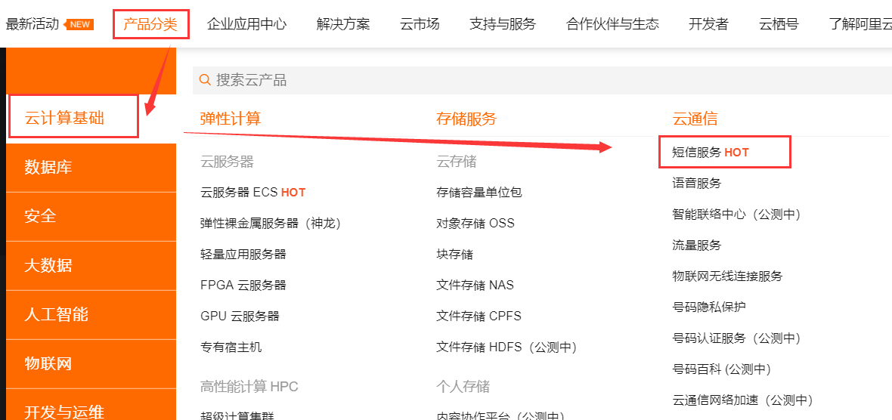
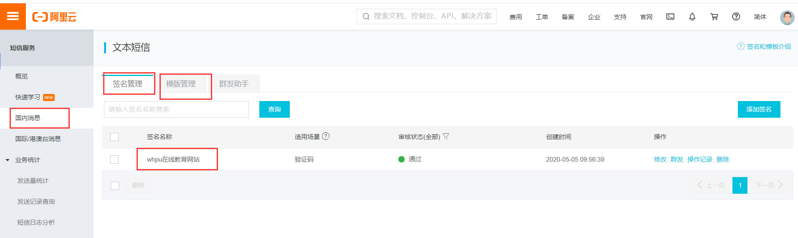

#  阿里云官方短信接口

[阿里云短信SDK官方文档](https://help.aliyun.com/document_detail/101874.html?spm=a2c4g.11186623.6.650.64403d9cfUzjRJ)

## 引入依赖

需要安装阿里云短信开发SDK

```xml
<dependency>
    <groupId>com.aliyun</groupId>
    <artifactId>aliyun-java-sdk-core</artifactId>
    <version>4.1.0</version>
</dependency>
```

## 申请模板和签名







[短信签名申请](https://help.aliyun.com/document_detail/108072.html?spm=a2c4g.11186623.6.565.460c16a9uqWWY5)

短信签名是短信服务提供的一种快捷、方便的个性化签名方式。当发送短信时，短信平台会根据设置，在短信内容里附加个性签名，再发送给指定手机号码。

[短信模板申请](https://help.aliyun.com/document_detail/108086.html?spm=a2c4g.11186623.6.571.3c513d9c44UDmN)

短信模版，即具体发送的短信内容。短信模版可以支持验证码、短信通知、推广短信三种模式。验证码和短信通知，通过变量替换实现个性短信定制。

## 发送Demo

[短信接口API官方文档](https://api.aliyun.com/?spm=a2c4g.11186623.2.13.43e850a4f1NvdU#/?product=Dysmsapi&version=2017-05-25&api=SendSms&tab=DEMO&lang=JAVA)

要使用自己的AccessId和AccessSecret，如果使用的是子账户的AccessId和AccessSecret的话要注意授予这个子账户短信权限

```java
public boolean send(Map<String, Object> param, String phone) {
    if(StringUtils.isEmpty(phone)) return false;
    //accessId  accessSecret要填写自己阿里云的访问id和密码
    //注意：要授予这个accessId和accessSecret发送短信的全新
    DefaultProfile profile =
      DefaultProfile.getProfile("default", "accessId", "accessSecret");
    IAcsClient client = new DefaultAcsClient(profile);

    //设置相关固定的参数，新版API
    CommonRequest request = new CommonRequest();
    request.setSysMethod(MethodType.POST);
    request.setSysDomain("dysmsapi.aliyuncs.com");
    request.setSysVersion("2017-05-25");
    request.setSysAction("SendSms");
    request.putQueryParameter("RegionId", "cn-hangzhou");
  /*
    旧版API
    request.setProtocol(ProtocolType.HTTPS);
    request.setMethod(MethodType.POST);
    request.setDomain("dysmsapi.aliyuncs.com");
    request.setVersion("2017-05-25");
    request.setAction("SendSms");

    */


    //设置发送相关的参数
    request.putQueryParameter("PhoneNumbers",phone); //手机号
    request.putQueryParameter("SignName","whpu在线教育网站"); //申请阿里云 签名名称
    request.putQueryParameter("TemplateCode","SMS_189611764"); //申请阿里云 模板code
    request.putQueryParameter("TemplateParam", JSONObject.toJSONString(param)); //验证码数据，转换json数据传递

    try {
      //最终发送
      CommonResponse response = client.getCommonResponse(request);
      System.out.println("response ========>"+response);
      System.out.println("response data =====>"+response.getData());
      System.out.println("response status=======>"+response.getHttpStatus());
      boolean success = response.getHttpResponse().isSuccess();
      return success;
    }catch(Exception e) {
      e.printStackTrace();
      return false;
    }

  }

```

使用阿里云官方提供短信接口的好处

+ 统一的SDK，文档Demo较全，易于安装，易于学习
+ 阿里云提供短信发送控制台可以实时监控短信发送
+ 按条计费，不用一次性买断。
+ 采用第三方短信接口的时候要导入很多第三方包，各个包的适配关系不好处理。阿里云由官方一共一个短信开发SDK即可解决。推荐使用阿里云官方的包

# 阿里云市场第三方短信接口

去阿里云的云市场中购买第三方短信接口，购买成功之后卖家提供APP_Code和APP_Key

[示例地址](https://market.aliyun.com/products/57126001/cmapi029993.html?spm=5176.2020520132.101.1.463a7218UGDfgd#sku=yuncode2399300001)

## 引入依赖

除了使用到下面这些组件发送短信的时候还是到了HttpUtils，从[github](https://github.com/aliyun/api-gateway-demo-sign-java/blob/master/src/main/java/com/aliyun/api/gateway/demo/util/HttpUtils.java)下载这个类源码导入项目即可

其实也可以直接导入上面阿里云短信SDK，因为阿里云短信SDK包含了下面了下面这些依赖。HttpUtils也需要自己手动导入

```xml
 <dependencies>
		<dependency>
			<groupId>com.alibaba</groupId>
			<artifactId>fastjson</artifactId>
			<version>1.2.15</version>
		</dependency>
        <dependency>
            <groupId>org.apache.httpcomponents</groupId>
            <artifactId>httpclient</artifactId>
            <version>4.2.1</version>
        </dependency>
        <dependency>
            <groupId>org.apache.httpcomponents</groupId>
            <artifactId>httpcore</artifactId>
            <version>4.2.1</version>
        </dependency>
        <dependency>
            <groupId>commons-lang</groupId>
            <artifactId>commons-lang</artifactId>
            <version>2.6</version>
        </dependency>
        <dependency>
            <groupId>org.eclipse.jetty</groupId>
            <artifactId>jetty-util</artifactId>
            <version>9.3.7.v20160115</version>
        </dependency>
        <dependency>
            <groupId>junit</groupId>
            <artifactId>junit</artifactId>
            <version>4.5</version>
            <scope>test</scope>
        </dependency>
    </dependencies>
```

## 申请模板和签名

购买成功之后，联系卖家申请模板和签名，模板和签名都需要备案和审核。

## 编写代码

需要注意的是第三方短信发送使用了HttpUtils，下载下来导入文件即可。

说明：不同的第三方提供接口中中要发送的参数可能不一样。

但是所有的第三方短信接口都需要使用签名和模板，下面这个接口中的签名和模板和验证码都放到参数content里边。【】里边的就是签名，5873为验证码，其余部分是模板。有的第三方接口这三个分别由三个参数设置。

第三方提供的Demo

```java
public static void main(String[] args) {
	    String host = "https://cxkjsms.market.alicloudapi.com";
	    String path = "/chuangxinsms/dxjk";
	    String method = "POST";
	    String appcode = "你自己的AppCode";
	    Map<String, String> headers = new HashMap<String, String>();
	    //最后在header中的格式(中间是英文空格)为Authorization:APPCODE 83359fd73fe94948385f570e3c139105
	    headers.put("Authorization", "APPCODE " + appcode);
	    Map<String, String> querys = new HashMap<String, String>();
	    //测试可用默认短信模板,测试模板为专用模板不可修改,如需自定义短信内容或改动任意字符,请联系旺旺或QQ726980650进行申请
    	//【】里边的就是签名，你的验证码...就是模板。签名和模板需要向后台申请
        querys.put("content", "【创信】你的验证码是：5873，3分钟内有效！");
	    querys.put("mobile", "13568813957");
	    Map<String, String> bodys = new HashMap<String, String>();


	    try {
	    	/**
	    	* 重要提示如下:
	    	* HttpUtils请从
	    	* https://github.com/aliyun/api-gateway-demo-sign-java/blob/master/src/main/java/com/aliyun/api/gateway/demo/util/HttpUtils.java
	    	* 下载
	    	*
	    	* 相应的依赖请参照
	    	* https://github.com/aliyun/api-gateway-demo-sign-java/blob/master/pom.xml
	    	*/
	    	HttpResponse response = HttpUtils.doPost(host, path, method, headers, querys, bodys);
	    	System.out.println(response.toString());
	    	//获取response的body
	    	//System.out.println(EntityUtils.toString(response.getEntity()));
	    } catch (Exception e) {
	    	e.printStackTrace();
	    }
	}
```

业务Demo

```java
/**
   * 给远程第三方短信接口发送请求把验证码发送到用户手机上
   * @param host		短信接口调用的URL地址
   * @param path		具体发送短信功能的地址
   * @param method	请求方式
   * @param phoneNum	接收短信的手机号
   * @param appCode	用来调用第三方短信API的AppCode
   * @param sign		签名编号
   * @param skin		模板编号
   * @return 返回调用结果是否成功
   * 	成功：返回验证码
   * 	失败：返回失败消息
   * 	状态码: 200 正常；400 URL无效；401 appCode错误； 403 次数用完； 500 API网管错误
   */
  public static R sendCodeByShortMessage(

    String host,

    String path,

    String method,

    String phoneNum,

    String appCode,
) {

    Map<String, String> headers = new HashMap<String, String>();

    // 最后在header中的格式(中间是英文空格)为Authorization:APPCODE 83359fd73fe94948385f570e3c139105
    headers.put("Authorization", "APPCODE " + appCode);
    // 封装其他参数
    Map<String, String> querys = new HashMap<String, String>();
    // 生成验证码
    StringBuilder builder = new StringBuilder();
    for(int i = 0; i < 4; i++) {
      int random = (int) (Math.random() * 10);
      builder.append(random);
    }
    String code = builder.toString();
    // 收短信的手机号
    querys.put("mobile",phoneNum);
    //content参数里边存放模板和签名【】里边是签名，其余为模板，code是后台动态生成的
    querys.put("content", "【whpu校园】您的验证码是："+code+"，10分钟内有效！");

    try {
      HttpResponse response = HttpUtils.doPost(host, path, method, headers, querys, querys);
      StatusLine statusLine = response.getStatusLine();
      // 状态码: 200 正常；400 URL无效；401 appCode错误； 403 次数用完； 500 API网管错误
      int statusCode = statusLine.getStatusCode();

      String reasonPhrase = statusLine.getReasonPhrase();
      System.out.println("状态码====》"+statusCode);
      System.out.println("reasonPhase ====>"+reasonPhrase);

      if(statusCode == 200) {
        // 操作成功，把生成的验证码返回
        return R.ok();
      }
      return R.error();
    } catch (Exception e) {
      e.printStackTrace();
      return R.ok();
    }

  }
```


