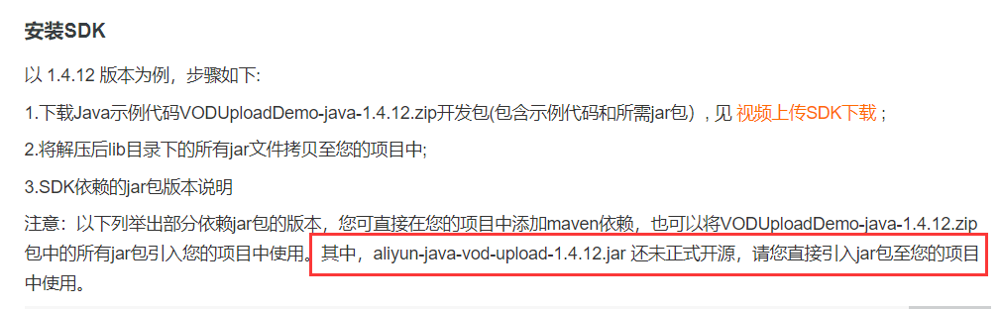
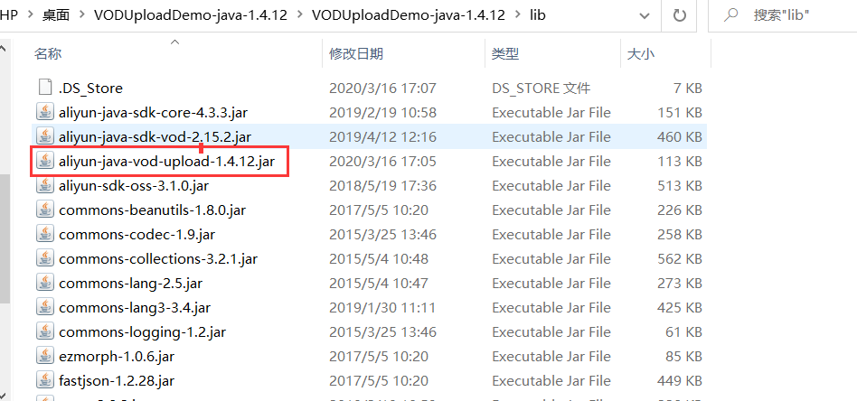

阿里云视频点播中如果存储的是加密的视频HLS格式（需要在转码模板组中配置），仅仅使用阿里云中视频URL地址是无法播放视频的，还需要视频播放凭证。如果采用的普通存储未加密，使用阿里云中视频URL地址是可以播放的。因此我们存储在数据库中的信息一般不是视频的URL地址，而是阿里云分配的视频id，通过id可以获取视频的凭证以及视频的URL地址。既可以播放加密也可以播放未加密的视频。


# 阿里云视频服务环境

上传视频到阿里云，首先需要安装上传视频到阿里云的SDK

[引入依赖](https://help.aliyun.com/document_detail/53406.html?spm=a2c4g.11186623.6.1065.10073815AgaUUD)，安装阿里云视频服务SDK

```xml
 <dependency>
        <groupId>com.aliyun</groupId>
        <artifactId>aliyun-java-sdk-core</artifactId>
        <version>4.3.3</version>
    </dependency>
    <dependency>
        <groupId>com.aliyun.oss</groupId>
        <artifactId>aliyun-sdk-oss</artifactId>
        <version>3.1.0</version>
    </dependency>
     <dependency>
        <groupId>com.aliyun</groupId>
        <artifactId>aliyun-java-sdk-vod</artifactId>
        <version>2.15.2</version>
    </dependency>
    <dependency>
        <groupId>com.alibaba</groupId>
        <artifactId>fastjson</artifactId>
        <version>1.2.28</version>
    </dependency>
    <dependency>
        <groupId>org.json</groupId>
        <artifactId>json</artifactId>
        <version>20170516</version>
    </dependency>
    <dependency>
        <groupId>com.google.code.gson</groupId>
        <artifactId>gson</artifactId>
        <version>2.8.2</version>
    </dependency>
```


[官方SDK](https://help.aliyun.com/document_detail/53406.html?spm=a2c4g.11186623.6.1065.10073815AgaUUD)安装注意事项：



由于==aliyun-java-vod-upload组件并没有开源==，所以无法从Maven中央仓库中下载。此时必须要从官网上下载Java开发SDK的jar包。[java开发SDK下载地址](https://help.aliyun.com/document_detail/51992.html?spm=a2c4g.11186623.4.2.281f3815xgZKfR)



下载下来之后需要把这个未开源的组件引入项目中。有两种方式：

1. 直接把jar包引入项目中引入方式

   > Eclipse中选择您的工程，右击 -> Properties -> Java Build Path -> Add JARs;
   >
   > IntelliJ IDEA中打开您的工程，File -> Project Structure -> Modules -> 右侧Dependencies -> + -> JARs or directories

2. 把这个jar包安装到本地仓库，安装方式

   > 进入aliyun-java-vod-upload包所在目录，执行maven命令，前提必须正确安装Maven并且配置环境变量
   >
   > 
   >
   > mvn install:install-file -DgroupId=com.aliyun -DartifactId=aliyun-sdk-vod-upload  -Dversion=1.4.12 -Dpackaging=jar -Dfile=aliyun-java-vod-upload-1.4.12.jar
   >
   > 也可以找到本地仓库，直接把这个jar包拷贝到本地仓库对应位置即可即可

   

# 应用Demo

## 初始化SDK

创建DefaulstAcsClient对象

[初始化文档](https://help.aliyun.com/document_detail/61062.html?spm=a2c4g.11186623.6.907.68ed24d8AiiAi6)

```java
public class InitVod {

  public static DefaultAcsClient initVodClient(String accessKeyId, String accessKeySecret) throws ClientException {
    String regionId = "cn-shanghai";  // 点播服务接入区域
    DefaultProfile profile = DefaultProfile.getProfile(regionId, accessKeyId, accessKeySecret);
    DefaultAcsClient client = new DefaultAcsClient(profile);
    return client;
  }
}
```


## 获取播放视频基本信息

[官方文档](https://help.aliyun.com/document_detail/61064.html?spm=a2c4g.11186623.6.909.150d3bd9IwfWrL)

```java
 @Test
  //获取视频播放URL
  public void testVodUrl() throws ClientException {
    //创建初始化对象
    DefaultAcsClient client = InitVod.initVodClient("LTAI4GB9t7rhQZbkTFjVKVQT", "ow7LdUiEPvq517mXp1sFF41aVST2l3");

    //创建获取视频地址request和response
    GetPlayInfoRequest request = new GetPlayInfoRequest();
    GetPlayInfoResponse response = new GetPlayInfoResponse();

    //向request对象里面设置视频id
    request.setVideoId("416b094890cd458fa55f81e12b69add8");

    //调用初始化对象里面的方法，传递request，获取数据
    response = client.getAcsResponse(request);

    List<GetPlayInfoResponse.PlayInfo> playInfoList = response.getPlayInfoList();
    //播放地址
    for (GetPlayInfoResponse.PlayInfo playInfo : playInfoList) {
      System.out.print("PlayInfo.PlayURL = " + playInfo.getPlayURL() + "\n");
    }
    //Base信息
    System.out.print("VideoBase.Title = " + response.getVideoBase().getTitle() + "\n");
  }

```


获取视频播放凭证

[官方文档](https://help.aliyun.com/document_detail/61064.html?spm=a2c4g.11186623.6.909.31617bdcoxkUZw)

```java
 @Test
  //获取视频播放凭证,通过GetVideoPlayAuthRequest，和RequestGetPloyRequest获取的
  public void testVodInfo() throws ClientException {
    //初始化Client
    DefaultAcsClient client = InitVod.initVodClient("LTAI4GB9t7rhQZbkTFjVKVQT", "ow7LdUiEPvq517mXp1sFF41aVST2l3");
    //获得GetVideoPlayAuth和GetVideoPlayAuthResponse对象
    GetVideoPlayAuthRequest request = new GetVideoPlayAuthRequest();
    GetVideoPlayAuthResponse response = new GetVideoPlayAuthResponse();
    //在reqeust对象中设置播放视频的id
    request.setVideoId("416b094890cd458fa55f81e12b69add8");

    response = client.getAcsResponse(request);
    //获得视频播放凭证
    System.out.println(response.getPlayAuth());

  }
```


## 本地视频上传阿里云

具体可以参考本地下载SDK的参考Demo

```java
 @Test
  public void testUploadVod(){
    String accessKeyId = "LTAI4GB9t7rhQZbkTFjVKVQT";
    String accessKeySecret = "ow7LdUiEPvq517mXp1sFF41aVST2l3";

    String title = "6 - What If I Want to Move Faster - upload by sdk";   //上传之后文件名称
    String fileName = "C:\\Users\\HP\\Desktop\\阿里云\\6 - What If I Want to Move Faster.mp4";  //本地文件路径和名称
    //上传视频的方法
    UploadVideoRequest request = new UploadVideoRequest(accessKeyId, accessKeySecret, title, fileName);
    /* 可指定分片上传时每个分片的大小，默认为2M字节 */
    request.setPartSize(2 * 1024 * 1024L);
    /* 可指定分片上传时的并发线程数，默认为1，(注：该配置会占用服务器CPU资源，需根据服务器情况指定）*/
    request.setTaskNum(2);

    UploadVideoImpl uploader = new UploadVideoImpl();
    UploadVideoResponse response = uploader.uploadVideo(request);

    if (response.isSuccess()) {
      System.out.print("VideoId=" + response.getVideoId() + "\n");
    } else {
      /* 如果设置回调URL无效，不影响视频上传，可以返回VideoId同时会返回错误码。其他情况上传失败时，VideoId为空，此时需要根据返回错误码分析具体错误原因 */
      System.out.print("VideoId=" + response.getVideoId() + "\n");
      System.out.print("ErrorCode=" + response.getCode() + "\n");
      System.out.print("ErrorMessage=" + response.getMessage() + "\n");
    }
      
  }
```


## 删除视频

 [删除视频官方文档](https://help.aliyun.com/document_detail/61065.html?spm=a2c4g.11186623.6.910.281f3815vcna9m)

```java
 public static DefaultAcsClient initVodClient(String accessKeyId, String accessKeySecret) throws ClientException {
    String regionId = "cn-shanghai";  // 点播服务接入区域
    DefaultProfile profile = DefaultProfile.getProfile(regionId, accessKeyId, accessKeySecret);
    DefaultAcsClient client = new DefaultAcsClient(profile);
    return client;
  }

  public boolean removeVideo(String videoId) {
    try {
      String accessKeyId = aliyunConfig.getKeyId();
      String accessKeySecret = aliyunConfig.getKeySecret();
      DefaultAcsClient client = initVodClient(accessKeyId, accessKeySecret);

      DeleteVideoRequest request = new DeleteVideoRequest();
      DeleteVideoResponse response = new DeleteVideoResponse();
      request.setVideoIds(videoId);
      response = client.getAcsResponse(request);
      return true;
    } catch (com.aliyuncs.exceptions.ClientException e) {
      e.printStackTrace();
      return false;
    }

  }
```


